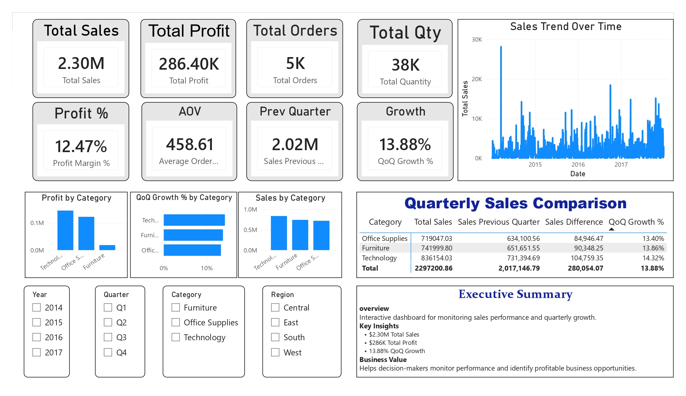
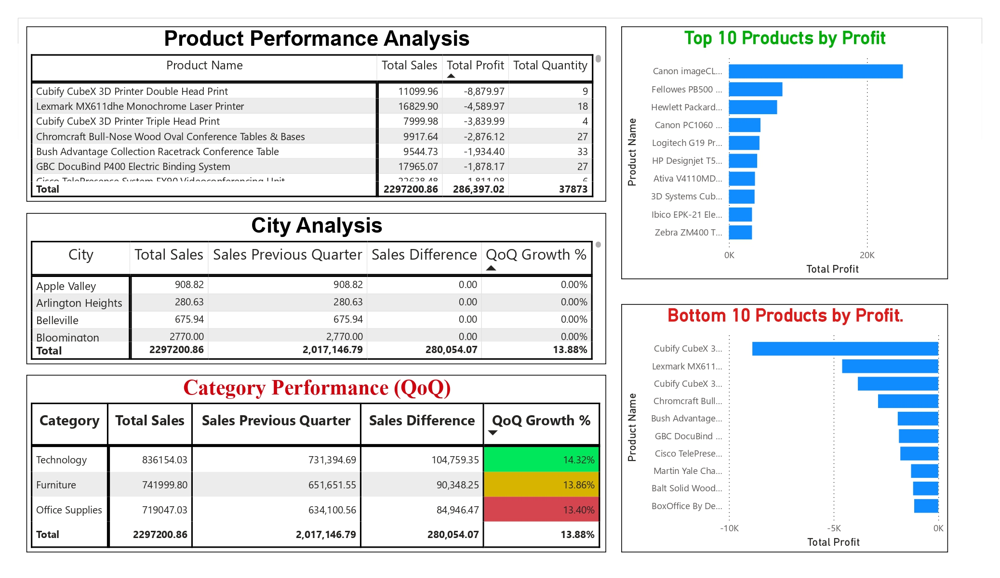
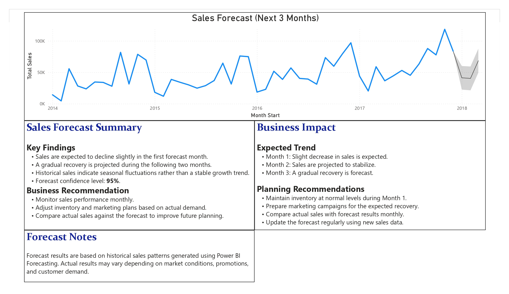

# 📊 ElectroMart Sales Analytics Dashboard

## 📌 Project Overview

This project analyzes ElectroMart's sales performance using Microsoft Power BI. The dashboard provides interactive insights into sales trends, product profitability, quarterly growth, and future sales forecasting to support data-driven business decisions.

---

## 🎯 Business Objectives

- Analyze overall sales performance.
- Identify top and bottom-performing products.
- Compare Quarter-over-Quarter (QoQ) sales growth.
- Evaluate category and city performance.
- Forecast sales for the next three months.

---

## 📂 Dataset

The project is based on a retail sales dataset containing customer, product, order, and sales transaction information.

---

## 🗂 Data Model

The dashboard follows a **Star Schema** consisting of:

- Fact Sales
- Dim Date
- Dim Product
- Dim Customer

---

## 🛠 Tools & Technologies

- Microsoft Power BI
- Power Query
- DAX
- Microsoft Excel

---

## 💼 Skills Demonstrated

- Data Cleaning
- Data Modeling
- DAX Calculations
- KPI Design
- Dashboard Development
- Business Analysis
- Data Visualization
- Sales Forecasting

---

## 📈 Dashboard Pages

### Executive Overview

- Sales KPIs
- Profit Analysis
- Sales Trend
- Quarterly Sales Comparison

### Sales Analysis

- Product Performance Analysis
- Top 10 Products
- Bottom 10 Products
- Category Performance
- City Analysis

### Sales Forecast

- Sales Forecast
- Forecast Summary
- Business Recommendations
- Business Impact

---

## 🚧 Challenges

During the project, several challenges were addressed:

- Cleaning inconsistent sales data.
- Building a Star Schema data model.
- Creating DAX measures for KPIs and QoQ Growth.
- Designing an interactive Power BI dashboard.
- Building a three-month sales forecast.

---

## 📊 Project Results

- Total Sales: **$2.30M**
- Total Profit: **$286.40K**
- Profit Margin: **12.47%**
- QoQ Growth: **13.88%**
- Developed an interactive executive dashboard.
- Identified top and bottom-performing products.
- Built a three-month sales forecasting model.

---

## 📷 Dashboard Preview

### Executive Overview

The following screenshots present the final Power BI dashboard.

---

### Sales Analysis

---

### Sales Forecast

---

## 💡 Key Insights

- Technology generated the highest profit.
- Several products generated negative profit despite high sales.
- Quarterly sales increased by **13.88%**.
- Forecast results indicate a slight decline followed by gradual recovery.

---

## 📈 Business Recommendations

- Focus on high-profit products.
- Review pricing strategy for low-profit products.
- Optimize inventory planning using forecast results.
- Monitor quarterly performance continuously.

---

## 🚀 Future Improvements

- Add customer segmentation analysis.
- Integrate real-time data sources.
- Build automated KPI alerts.
- Publish the dashboard using Power BI Service.

---
## 📄 License

This project is licensed under the MIT License.

---

## 👤 Author

**Yazan Nasser Al-Baydani**

Data Analyst

LinkedIn: *(سنضيف الرابط بعد إنشاء الملف الشخصي بشكل كامل)*

GitHub: *(رابط المستودع)*
